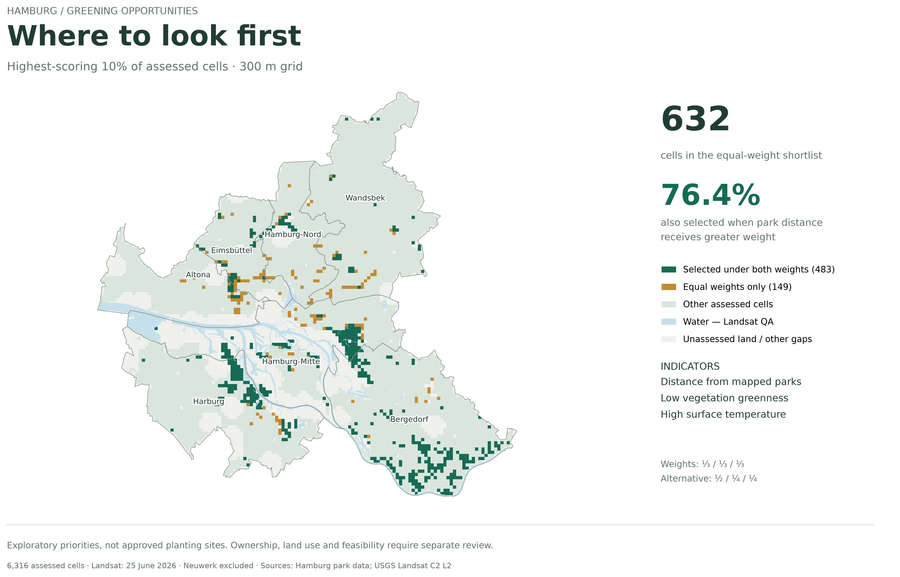
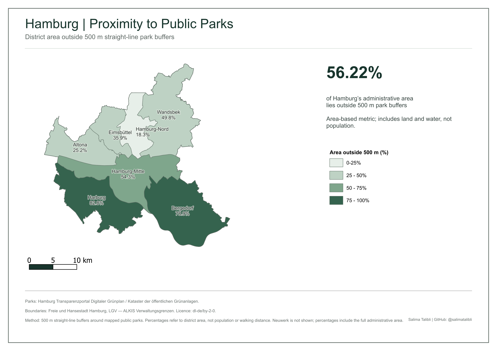
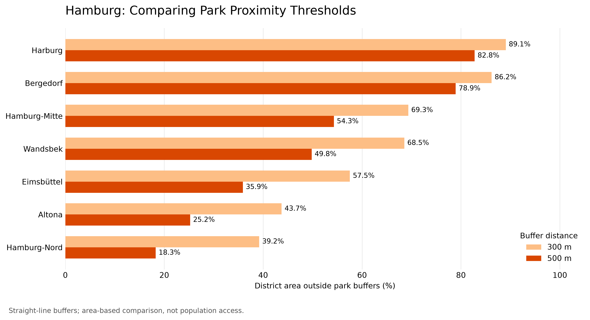
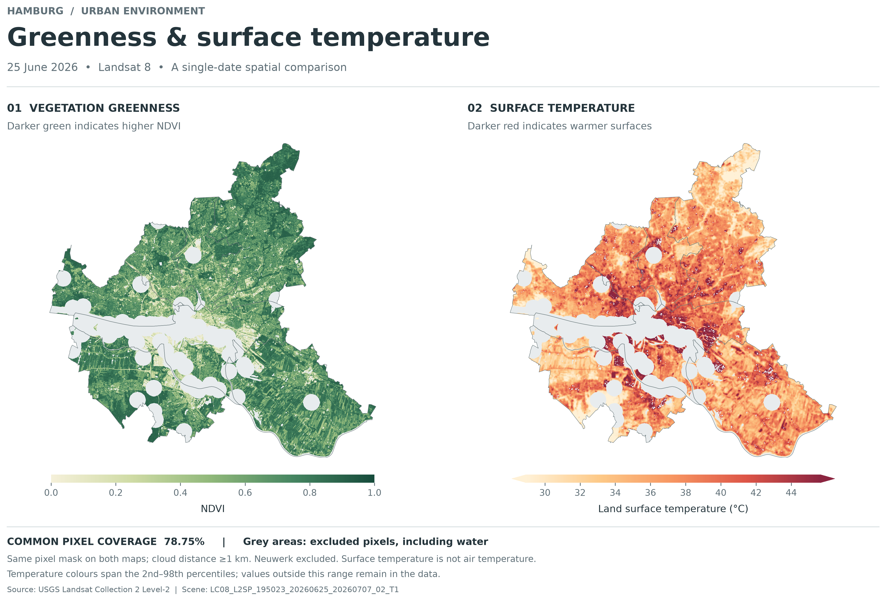
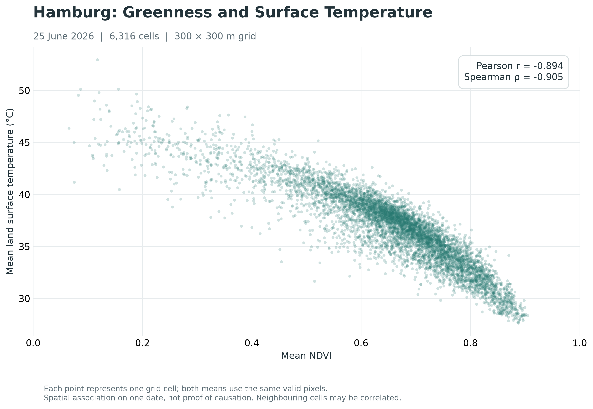

# Hamburg Green Space: Park Proximity, Surface Heat and Greening Priorities

A GIS and Python portfolio project exploring where Hamburg is distant from mapped public parks, how vegetation greenness relates to land surface temperature, and which assessed areas merit further investigation for greening.

**Tools:** QGIS · Python · GeoPandas · Rasterio · NumPy · pandas · Matplotlib · Folium

## Key findings

- **56.22% of Hamburg's administrative area** lies outside 500 m straight-line buffers around the selected park features. This includes land and water; it is not the percentage of residents without park access.
- Across **6,316 retained 300 m cells**, mean NDVI and mean land surface temperature on **25 June 2026** have a strong negative association: Pearson **r = −0.894**, Spearman **ρ = −0.905**.
- The equal-weight screening model selects **632 cells** in its top 10%. **483 cells (76.4%)** remain selected when the weight on park distance increases.

These findings describe spatial patterns and exploratory priorities. They do not establish causality or identify approved planting sites.

## Explore the outputs

| Analysis | Main output | Supporting output |
| --- | --- | --- |
| Park proximity | [500 m proximity map (PDF)](outputs/hamburg_park_proximity_500m.pdf) | [300 m vs 500 m district comparison](outputs/district_park_proximity_300m_vs_500m.png) |
| Greenness and surface heat | [NDVI and temperature maps](outputs/hamburg_ndvi_lst_20260625_styled.png) | [Scatter plot](outputs/hamburg_ndvi_lst_scatter_20260625.png) |
| Greening priorities | [Priority shortlist map](outputs/hamburg_greening_shortlist_water.png) | [Scores table](outputs/hamburg_greening_priority_scores.csv) |
| Interactive exploration | [Interactive HTML map](outputs/hamburg_greening_interactive_v2.html) | Click cells to view their indicators and toggle the selection layers. |

Download the interactive HTML file and open it in a browser. GitHub's file viewer does not run the map. The final version uses local vector data instead of background tile services; its JavaScript and CSS libraries still require internet access.

## 1. Park proximity

The analysis uses seven district features and **951 features classified as `Parkanlagen`**, selected from 3,579 public green-space features. Feature count does not necessarily equal the number of distinct parks. Other green-space categories are excluded.

Preparation and analysis:

1. Correct the source CRS assignment to **EPSG:25832**. The projected source coordinates had initially been interpreted as geographic coordinates.
2. Repair three invalid park geometries using QGIS Fix Geometries (Structure method). All 951 resulting geometries pass validation.
3. Generate 300 m and 500 m park buffers and clip them to the city boundary.
4. Calculate district area outside each buffer coverage and compare results in Python.

| District | Area outside 300 m buffers (%) | Area outside 500 m buffers (%) |
| --- | ---: | ---: |
| Harburg | 89.06 | 82.76 |
| Bergedorf | 86.21 | 78.94 |
| Hamburg-Mitte | 69.34 | 54.30 |
| Wandsbek | 68.54 | 49.81 |
| Eimsbüttel | 57.54 | 35.89 |
| Altona | 43.73 | 25.23 |
| Hamburg-Nord | 39.21 | 18.27 |

Python reproduced the QGIS 500 m percentages to **0.0000 percentage points at the reported precision**. Checks also confirmed seven unique districts, valid geometries, complete area values and consistent percentages.

Notebook: [01_park_access_analysis.ipynb](notebooks/01_park_access_analysis.ipynb)

## 2. Vegetation greenness and land surface temperature

Two Landsat 8 Collection 2 Level-2 scenes were assessed:

| Acquisition | Product identifier | Role |
| --- | --- | --- |
| 25 June 2026 | `LC08_L2SP_195023_20260625_20260707_02_T1` | Main analysis |
| 12 August 2026 | `LC08_L2SP_195023_20260812_20260816_02_T1` | Quality and coverage comparison |

The raster analysis excludes **7.621 km² of remote island geometry associated with Neuwerk**, retaining all seven districts. Its study area therefore differs from the full administrative extent used for the park-buffer area statistics.

Red and near-infrared surface reflectance are used to calculate NDVI. The Level-2 temperature band is converted to degrees Celsius. Quality screening excludes unavailable observations, flagged cloud/cirrus/shadow/snow, water, saturated pixels and high-aerosol observations, together with invalid reflectance or temperature values.

The main quality mask additionally requires at least **1 km distance from clouds**. A stricter sensitivity mask also requires reported temperature uncertainty of **3 K or less**. These thresholds are project choices.

| Quality measure | June | August |
| --- | ---: | ---: |
| Paired NDVI–temperature coverage of study area | 92.80% | 93.61% |
| Main-mask coverage | 78.75% | 53.28% |
| Strict-mask coverage | 64.27% | 31.77% |
| Median reported temperature uncertainty (K) | 2.55 | 3.20 |

June was selected for its higher retained coverage and lower median reported uncertainty. Temperatures from the two dates are not merged.

Aligned 30 m raster pixels are aggregated in 10 × 10 blocks to a **300 m grid**, anchored to the cropped June raster. A cell is retained when it contains at least 80 study-area pixels and at least 70% of those pixels have valid paired observations. Cell means use the same paired pixels for NDVI and temperature.

### Quality-mask sensitivity

| Sample | Cells | Pearson r | Spearman ρ |
| --- | ---: | ---: | ---: |
| Main mask: all retained cells | 6,316 | −0.894 | −0.905 |
| Main mask: common cells only | 5,147 | −0.899 | −0.898 |
| Strict mask: common cells | 5,147 | −0.898 | −0.897 |

The association changes little under this tested mask comparison. This does not establish robustness to other seasons, dates, spatial scales or confounding factors. Neighbouring cells are spatially dependent, so these correlations are descriptive rather than independent-sample significance tests.

Notebook: [02_greenness_surface_temperature.ipynb](notebooks/02_greenness_surface_temperature.ipynb)

## 3. Exploratory greening priorities

For each retained cell, three indicators are converted to percentile-rank scores:

- Greater straight-line distance from the cell centre to a mapped park.
- Lower mean NDVI.
- Higher mean land surface temperature.

The main score gives each indicator one-third weight. An alternative score gives park distance one-half weight and each remaining indicator one-quarter. The highest-scoring 632 cells form each shortlist; cell identifiers break score ties deterministically.

The median centre-to-park distance is **560.1 m**; **3,383 assessed cell centres** are more than 500 m from a mapped park. These are cell-centre statistics, distinct from the area-based district buffer results.

Of the 632 cells on the equal-weight shortlist, **483** are also selected under alternative weights and **149** are selected only under equal weights. The map displays those groups separately. It does not show all cells that enter only the alternative shortlist.

The score is relative to the assessed sample, not an absolute measure of need. Greenness and temperature are strongly related, so including both may give extra influence to a shared spatial pattern. The weight comparison is one sensitivity check, not a complete model validation.

## Data sources and attribution

### Hamburg district boundaries

- Dataset: [ALKIS – Verwaltungsgrenzen Hamburg](https://suche.transparenz.hamburg.de/dataset/alkis-verwaltungsgrenzen-hamburg31)
- Attribution: Freie und Hansestadt Hamburg, Landesbetrieb Geoinformation und Vermessung (LGV).
- Licence: [Datenlizenz Deutschland – Namensnennung 2.0](https://www.govdata.de/dl-de/by-2-0).
- Download recorded in project notes: **1 October 2026**.
- Changes: district selection, CRS assignment correction, projection and analysis-specific clipping; simplified contextual boundaries in the interactive map.

### Hamburg public green spaces

- Dataset: [Digitaler Grünplan / Kataster der öffentlichen Grünanlagen](https://suche.transparenz.hamburg.de/dataset/digitaler-gruenplan-kataster-der-oeffentlichen-gruenanlagen18)
- Attribution: Freie und Hansestadt Hamburg, Behörde für Umwelt und Energie, as specified in the dataset record.
- Licence: [Datenlizenz Deutschland – Namensnennung 2.0](https://www.govdata.de/dl-de/by-2-0).
- Download recorded in project notes: **1 October 2026**.
- Changes: selection of `gruen_art = 'Parkanlagen'`, CRS assignment correction, geometry repair, projection, buffering and derived distance calculations.

### Landsat imagery

- Provider: U.S. Geological Survey, Earth Resources Observation and Science Center.
- Dataset: [Landsat 8–9 OLI/TIRS Level-2, Collection 2](https://doi.org/10.5066/P9OGBGM6).
- Access: [USGS EarthExplorer](https://earthexplorer.usgs.gov/).
- USGS Landsat data are public domain; USGS is acknowledged as the source.
- Changes: cropping, quality masking, scaling, NDVI calculation, temperature conversion and spatial aggregation.

Hamburg source-data licences remain applicable to the corresponding source and derived data; they are not presented as a licence for all project code.

## Project organisation and reproduction

| Folder | Contents |
| --- | --- |
| `data_raw/` | Downloaded vector data and Landsat scene folders |
| `data_processed/` | Prepared GeoPackages and the priority-grid GeoJSON |
| `notebooks/` | Park analysis and greenness/temperature/priority analysis |
| `outputs/` | Maps, charts, CSV tables and interactive HTML |
| `qgis/` | QGIS project work |
| `docs/` | Preparation notes and project documentation |

The working environment uses Python 3.12 in a project-local `.venv`, with QGIS for vector preparation. Main Python packages include GeoPandas, Rasterio, NumPy, pandas, Matplotlib and Folium, plus their dependencies. A version-pinned environment file and clean-session reproduction check are still pending.

To reproduce the workflow:

1. Obtain the Hamburg datasets using the source links above. Prepare the district and park layers as described in the project notes.
2. Keep the prepared GeoPackages in `data_processed/`, including the clipped 300 m and 500 m buffers and district access summary used by notebook 01.
3. Download both named Landsat scenes into `data_raw/landsat/<product_identifier>/`.
4. For each scene, retain `SR_B4.TIF`, `SR_B5.TIF`, `ST_B10.TIF`, `QA_PIXEL.TIF`, `QA_RADSAT.TIF`, `SR_QA_AEROSOL.TIF`, `ST_QA.TIF`, `ST_CDIST.TIF` and `MTL.txt`, with their original product prefixes.
5. Select the project Python kernel and run notebook 01, followed by notebook 02, from top to bottom. Preserve the folder layout so relative project-path discovery works.
6. Open `outputs/hamburg_greening_interactive_v2.html` in a browser.

## Interpretation limits

- Park buffers measure straight-line proximity, not walking routes, entrances, barriers, park quality or capacity.
- District percentages describe administrative area, including water, rather than population exposure or equitable access.
- Park-feature filtering excludes other kinds of green space.
- Land surface temperature is not air temperature or a direct measure of human heat exposure.
- The June image is a single-date snapshot; it does not describe long-term climate or typical summer conditions.
- Quality filtering is spatially uneven. June main-mask coverage ranges from **47.77% in Hamburg-Mitte to 97.77% in Wandsbek**. Missing areas are not low-priority areas.
- The 300 m grid supports spatial comparison; it does not define parcels or feasible intervention boundaries.
- Ownership, existing land use, ecological value, infrastructure and planning constraints have not been assessed. Agricultural or other non-urban land may also receive high scores.

The project demonstrates a documented workflow connecting data preparation, spatial analysis, raster quality control, sensitivity checks and cartographic communication.

## Map gallery

### Park proximity by district

[View the full park proximity map (PDF)](outputs/hamburg_park_proximity_500m.pdf)

### Comparing 300 m and 500 m park buffers

### Vegetation and surface temperature

### Relationship between greenness and surface heat

### Interactive map

[Open the interactive map HTML file](outputs/hamburg_greening_interactive_v2.html)

To explore individual cells, download the HTML file and open it in a browser.